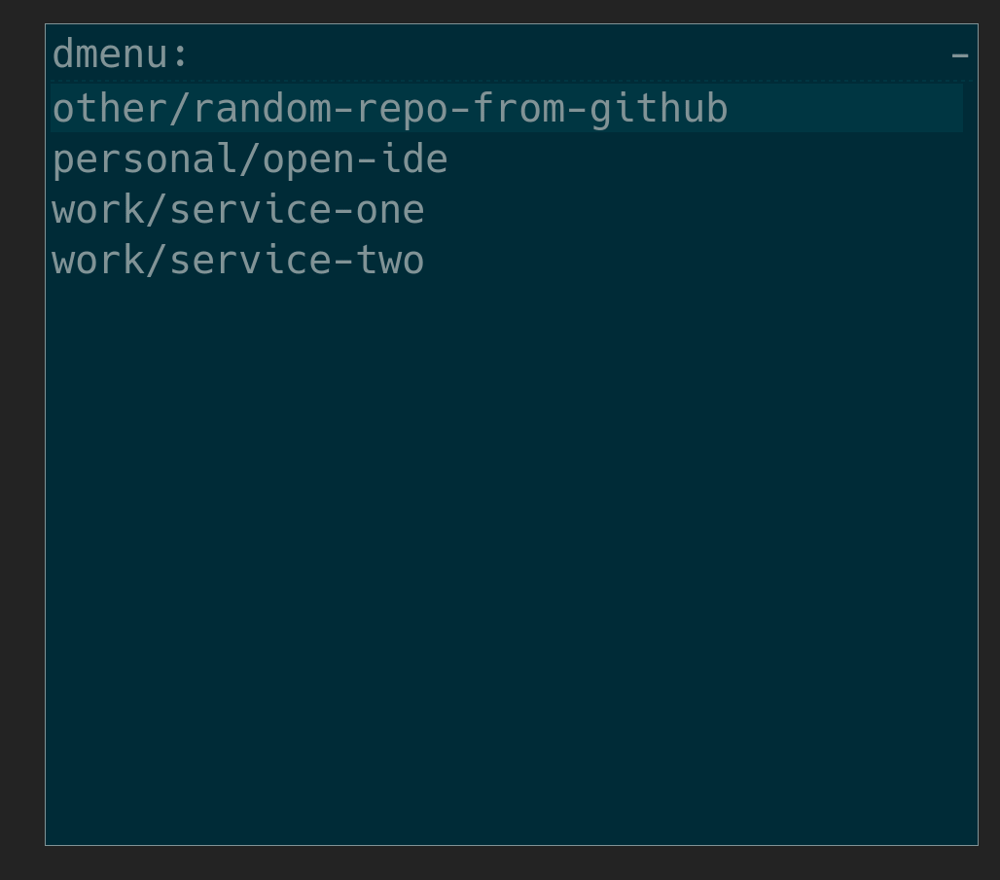

# About

This project solves a basic problem of navigating in a bunch of projects and opening them in IDE of your preference, which happens IntelliJ IDEA in my case.

# Demo



# Requirements

* rofi
  * [application launcher](https://github.com/davatorium/rofi) for project incremental searching

# Usage

```sh
go build
./open-ide --depth 3 --codeDir /home/user/code/ --ideCommand /opt/idea/idea
```
